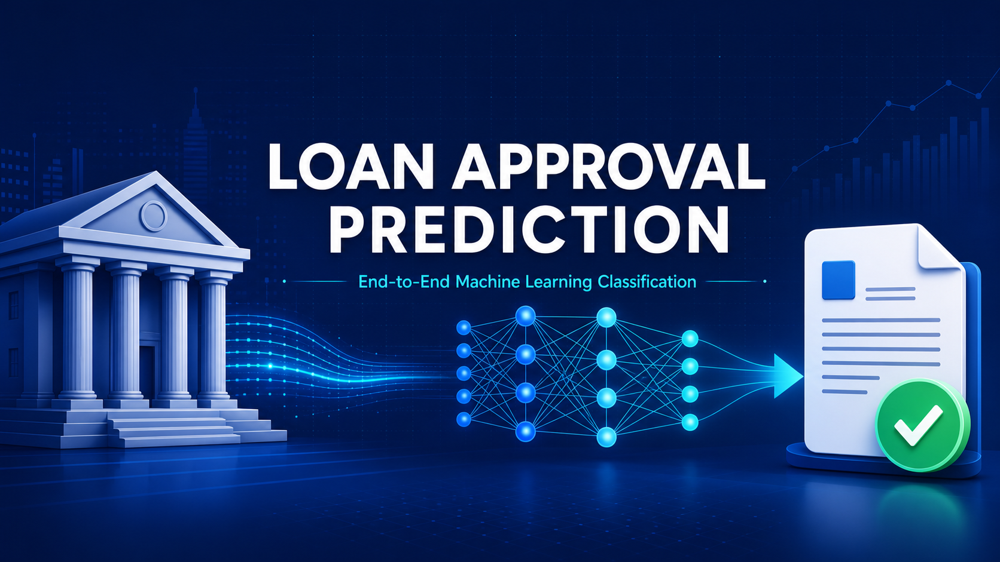
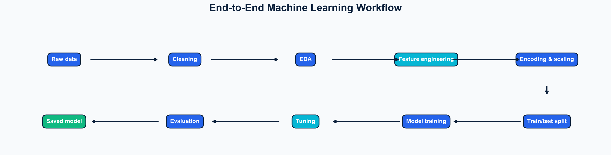
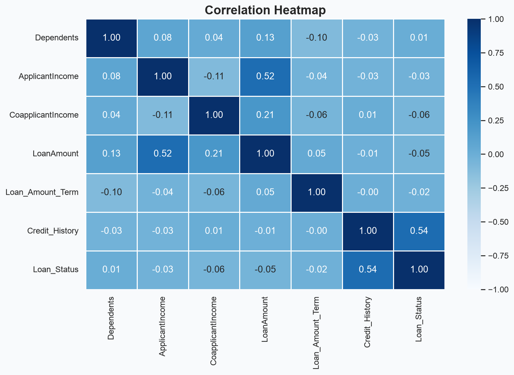
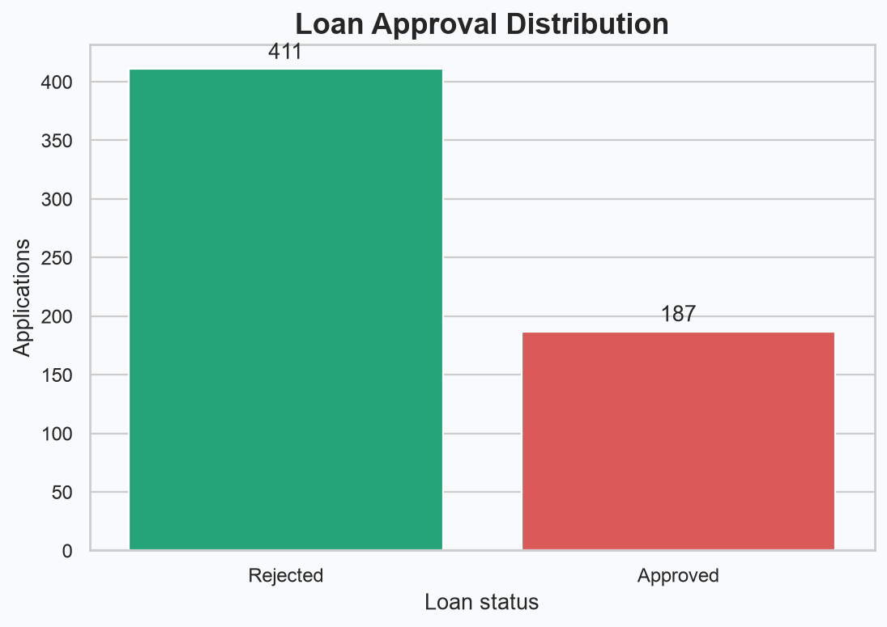
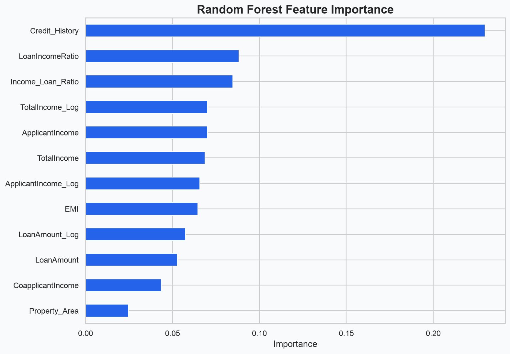
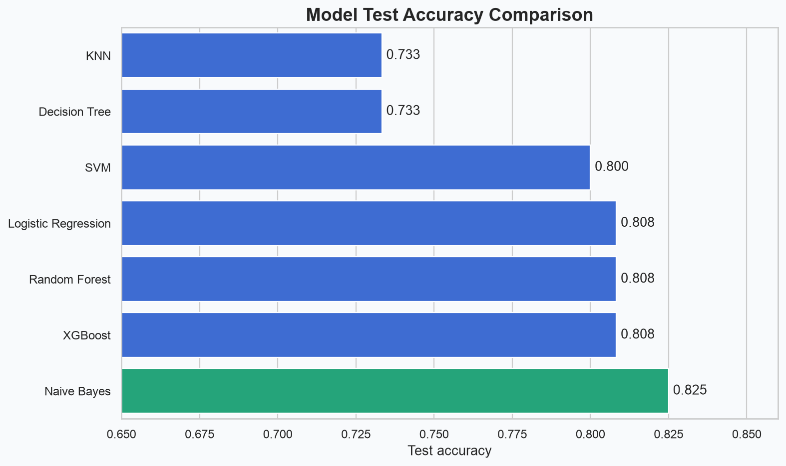
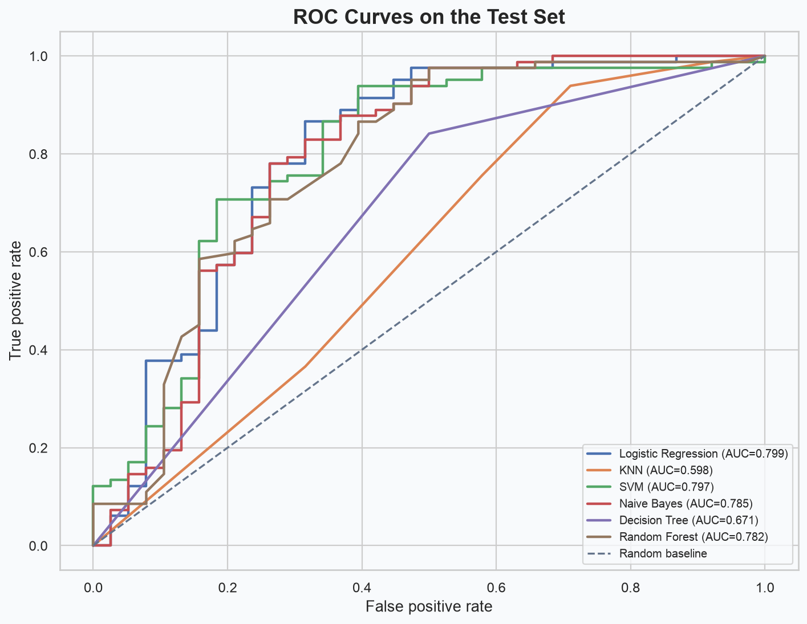
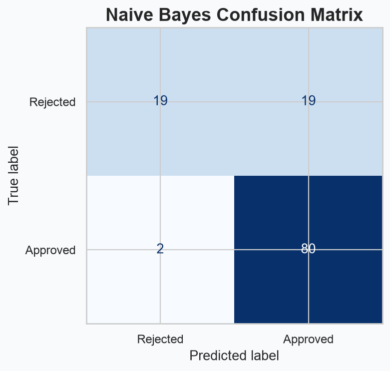

<p align="center">
  
</p>

<h1 align="center">Loan Approval Prediction using Machine Learning</h1>

<p align="center">
  An end-to-end classification project for predicting whether a loan application will be approved or rejected.
</p>

<p align="center">
  
  
  
  
  
</p>

## Overview

Financial institutions consider applicant income, requested loan terms, credit history, employment, education, dependents, and property area when evaluating a loan. This project explores those relationships and builds a reproducible machine-learning workflow that covers cleaning, EDA, feature engineering, model comparison, tuning, evaluation, and model persistence.

> This is an educational portfolio project. Its predictions are not suitable for real lending decisions without fairness, compliance, calibration, and production validation.

## Workflow

<p align="center">
  
</p>

## Dataset

The dataset contains applicant and loan characteristics with `Loan_Status` as the binary target (`Y` for approved and `N` for rejected).

| Feature | Description |
|---|---|
| `Gender` | Applicant gender |
| `Married` | Marital status |
| `Dependents` | Number of dependents |
| `Education` | Graduate status |
| `Self_Employed` | Self-employment status |
| `ApplicantIncome` | Applicant monthly income |
| `CoapplicantIncome` | Co-applicant monthly income |
| `LoanAmount` | Requested loan amount |
| `Loan_Amount_Term` | Loan duration |
| `Credit_History` | Credit-history indicator |
| `Property_Area` | Rural, urban, or semiurban area |
| `Loan_Status` | Approval target |

## Exploratory data analysis

The analysis covers missing values, duplicates, distributions, outliers, correlations, and univariate, bivariate, and multivariate relationships.

<table>
  <tr>
    <td align="center"><strong>Correlation heatmap</strong><br></td>
    <td align="center"><strong>Target distribution</strong><br></td>
  </tr>
</table>

## Feature engineering

| Feature | Definition |
|---|---|
| `TotalIncome` | Applicant income + co-applicant income |
| `Income_Loan_Ratio` | Total income / loan amount |
| `EMI` | Loan amount / loan term |
| `LoanIncomeRatio` | Loan amount / total income |
| `ApplicantIncome_Log` | Log-transformed applicant income |
| `LoanAmount_Log` | Log-transformed loan amount |
| `TotalIncome_Log` | Log-transformed total income |

Categorical encoding, standard scaling, mutual information, and tree-based feature importance are also explored.

<p align="center">
  
</p>

## Models and results

Seven classifiers were evaluated on the same stratified 80/20 train-test split.

| Model | Test accuracy | Precision | Recall | F1 | ROC-AUC |
|---|---:|---:|---:|---:|---:|
| Logistic Regression | 0.8083 | 0.7921 | 0.9756 | 0.8743 | 0.7991 |
| KNN | 0.7333 | 0.7404 | 0.9390 | 0.8280 | 0.6073 |
| SVM | 0.8000 | 0.7843 | 0.9756 | 0.8696 | 0.7949 |
| **Naive Bayes** | **0.8250** | **0.8081** | **0.9756** | **0.8840** | 0.7853 |
| Decision Tree | 0.7333 | 0.7841 | 0.8415 | 0.8118 | 0.6707 |
| Random Forest | 0.8083 | 0.8041 | 0.9512 | 0.8715 | 0.7823 |
| XGBoost | 0.8083 | 0.8041 | 0.9512 | 0.8715 | **0.8017** |

Naive Bayes achieved the highest test accuracy and F1 score in the saved comparison. XGBoost achieved the strongest ROC-AUC. The tree models reached perfect training accuracy but lower test accuracy, indicating overfitting.

<p align="center">
  
</p>

<table>
  <tr>
    <td align="center"><strong>ROC curves</strong><br></td>
    <td align="center"><strong>Best untuned model</strong><br></td>
  </tr>
</table>

Hyperparameter search uses `GridSearchCV` for Random Forest and SVM, `RandomizedSearchCV` for XGBoost, and five-fold stratified cross-validation.

## Project structure

```text
Loan_Approval_Prediction/
├── assets/                         # README banner and analysis visuals
├── data/
│   ├── LoanApprovalPrediction.csv  # Source dataset
│   └── processed/
│       ├── loan_clean.csv
│       └── loan_feature_engineered.csv
├── models/
│   ├── best_model.pkl
│   ├── final_model.pkl
│   └── scaler.pkl
├── notebooks/
│   ├── 01_data_loading.ipynb
│   ├── 02_data_cleaning.ipynb
│   ├── 03_eda.ipynb
│   ├── 04_feature_engineering.ipynb
│   ├── 05_model_building.ipynb
│   └── 06_hyperparameter_tuning.ipynb
├── reports/
│   └── model_comparison.csv
├── .gitignore
├── LICENSE
├── README.md
└── requirements.txt
```

## Installation

```bash
git clone https://github.com/YOUR_USERNAME/Loan_Approval_Prediction.git
cd Loan_Approval_Prediction

python -m venv .venv
source .venv/bin/activate        # Windows: .venv\Scripts\activate
python -m pip install --upgrade pip
pip install -r requirements.txt
jupyter lab
```

On macOS, XGBoost also requires the OpenMP runtime:

```bash
brew install libomp
```

Run the notebooks in numerical order. They document each stage from loading the source data through saving the selected model.

## Technologies

- Python, NumPy, and pandas
- Matplotlib and Seaborn
- scikit-learn and XGBoost
- JupyterLab
- Joblib model persistence

## Future improvements

- Package preprocessing and inference in a single reusable pipeline
- Add SHAP-based local and global explanations
- Evaluate class imbalance strategies such as SMOTE and class weighting
- Add probability calibration, threshold selection, and fairness diagnostics
- Add unit tests, data validation, and continuous integration
- Serve predictions through a small API or web application

## License

Distributed under the [MIT License](LICENSE).

## Author

**Lingareddy Dhanush**

If this project helped you, consider starring the repository.
